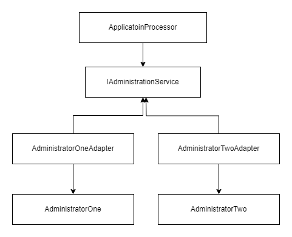

# Log

## What Was Done

The method ```ApplicationProcessor.Process(Application)``` was implemented in a test driven manner.

What tests does the ```ApplicationProcessor``` need? To answer this question, first we need to decide what the class does, what is its job?

What is the job of ```ApplicationProcessor```?

1. Validate the application.
2. Call the appropriate administrator to create the investor, their account and process the initial payment.
3. Send out events such as ```InvestorCreate```, ```AccountCreated```.

To allow for mixing and matching Administrators and Products, a new unifying interface was introduced, ```IAdministrationService```, and adaptors were created for AdministratorOne and AdministratorTwo:



The new class ```AdministrationDispatcher``` decides what Administrator to use for each Product. 

The new record called ```Product``` defines the age limits and the minimum payment for each product. It's currently private to the ApplicationProcessor class but it can be easily moved outside (possibly to Services.Common) so it can be read from a config file or a database.


## Assumptions

* The requirement "New Users must be Kyc'd" is ambiguous: "new" may mean "new to the application processor" or "new to the whole system" whose other parts may have seen a given user and ran KYC checks against them before. To allow for more flexibility, I created an ```IKycService``` implementation called ```KycReportCache``` that stores KYC reports in a ```ConcurrentDictionary```. By controlling the lifetime of this cache we can satisfy the requirements for either meaning of "new". 
* ```Services.Applications.Tests.csproj``` did not reference any unit testing tools. Assuming that the choice is mine, I went for my favourite combo of NUnit + Moq.


## Decisions

* The readme doesn't say what DomainEvents should be published is which cases. E.g. if the applicant age verification fails, should an ApplicationCompleted be raised? Or KycFailed? 
* Should KycFailed be raised once for each new user who fails the check or each time the application processor gets a KYC report with Verified==false? 
* I renamed ```ProductOneTests``` to ```ApplicationProcessorTests``` because they are testing the ```ApplicationProcessor``` class and there is no class called ```ProductOne```.

## Todo

* Resolve the "TODO:" comments in the code. 
* Add unit tests for ```GetFullYearsSince()```.
* Check what date format is expected in CreateInvestorRequest.DateOfBirth. 
* CreateInvestorRequest doesn't have a Country. What shall we do when the applicant is not in the UK?
* Currently ```InvestorCreated``` and ```AccountCreated``` are fired one after another. You may want to fire ```InvestorCreated``` sooner - before the account is created. In that case, we may want to move ```IBus.PublishAsync()``` calls for these events to ```AdministratorTwoAdapter```.

## Conclusion

Finally I must say that I have enjoyed doing this exercise because it was quite like real life coding: there's some degree of uncertainty in the requirements, there's a mixture of sync and async code, there's third party services that do similar things differently.  

